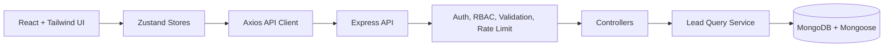
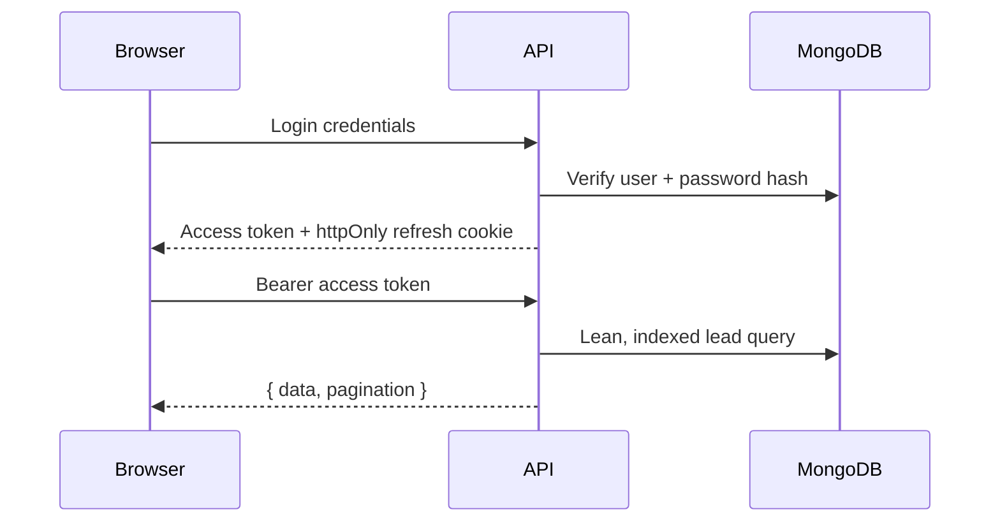

# Smart Leads Dashboard

A production-minded MERN + TypeScript lead management dashboard built for the Full Stack Intern assignment. The app includes secure JWT authentication with httpOnly refresh-token cookies, RBAC, indexed MongoDB queries, debounced search, backend pagination, CSV export, optimistic UI updates, dark mode, Docker, and starter tests.

## Architecture





## Tech Stack

- Frontend: React, TypeScript, TailwindCSS, Zustand, Axios, Zod, Vitest
- Backend: Node.js, Express, TypeScript, MongoDB, Mongoose, Zod, bcrypt, JWT, Helmet, express-rate-limit
- Infrastructure: Dockerfiles per workspace plus root `docker-compose.yml`

## Features

- User registration and login
- Short-lived access tokens and long-lived refresh tokens in secure httpOnly cookies
- Protected routes with automatic access-token refresh
- Admin and Sales User RBAC
- Lead CRUD with Admin-only delete
- Filters by status/source, partial search by name/email, latest/oldest sorting
- Backend pagination with strict response shape:

```json
{
  "data": [],
  "pagination": {
    "totalRecords": 0,
    "currentPage": 1,
    "totalPages": 1,
    "limit": 10
  }
}
```

- Debounced search at 300ms
- Optimistic status changes with rollback toast
- CSV export from a lean backend endpoint
- Loading skeletons, empty states, and error fallbacks
- System-aware dark mode persisted to `localStorage`

## Setup

1. Copy `.env.example` into `.env` at the project root.
2. Replace both JWT secrets with strong random strings of at least 32 characters.
3. Install dependencies:

```bash
npm install
```

4. Start MongoDB locally or use Docker.
5. Run the app:

```bash
npm run dev
```

Frontend runs on `http://localhost:5173` and backend runs on `http://localhost:5000`.

## Docker

```bash
docker compose up --build
```

This starts MongoDB, the backend API, and the Nginx-served frontend.

## API Documentation

Base URL: `/api`

### Auth

| Method | Endpoint | Description |
| --- | --- | --- |
| POST | `/auth/register` | Creates a user and returns an access token |
| POST | `/auth/login` | Authenticates and returns an access token |
| POST | `/auth/refresh` | Rotates refresh token and returns a new access token |
| POST | `/auth/logout` | Clears refresh-token cookie and server token hash |
| GET | `/auth/me` | Returns the authenticated user |

### Leads

All lead routes require `Authorization: Bearer <accessToken>`.

| Method | Endpoint | Description |
| --- | --- | --- |
| GET | `/leads` | List leads with filters, search, sort, and pagination |
| GET | `/leads/export` | Export the filtered lead set as CSV |
| POST | `/leads` | Create a lead |
| GET | `/leads/:id` | View one lead |
| PATCH | `/leads/:id` | Update a lead |
| DELETE | `/leads/:id` | Delete a lead, Admin only |

Query parameters for `GET /leads` and `/leads/export`:

- `status`: `New`, `Contacted`, `Qualified`, `Lost`
- `source`: `Website`, `Instagram`, `Referral`
- `search`: partial name or email match
- `sort`: `Latest` or `Oldest`
- `page`: positive integer

## Quality Commands

```bash
npm run typecheck
npm run test
npm run build
```

## Project Structure

```text
smart-leads-dashboard/
├── backend/
│   ├── src/
│   │   ├── config/
│   │   ├── controllers/
│   │   ├── middleware/
│   │   ├── models/
│   │   ├── routes/
│   │   ├── services/
│   │   ├── types/
│   │   ├── utils/
│   │   ├── app.ts
│   │   └── server.ts
│   └── tests/
├── frontend/
│   ├── src/
│   │   ├── components/
│   │   ├── context/
│   │   ├── hooks/
│   │   ├── pages/
│   │   ├── services/
│   │   ├── store/
│   │   ├── types/
│   │   └── utils/
│   └── tests/
├── docker-compose.yml
├── .env.example
└── README.md
```
